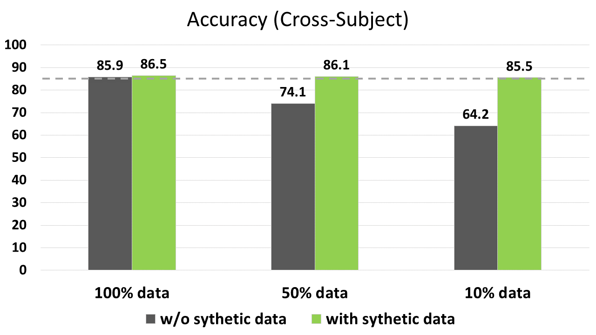
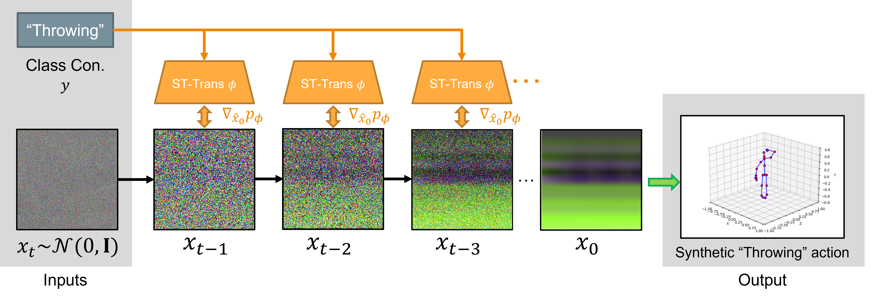

# Abstract

Recently, skeleton-based human action has become a hot research topic because the compact representation of human skeletons brings new blood to this research domain. As a result, researchers began to notice the importance of using RGB or other sensors to analyze human action by extracting skeleton information. Leveraging the rapid development of deep learning (DL), a significant number of skeleton-based human action approaches have been presented with fine-designed DL structures recently. However, a well-trained DL model always demands high-quality and sufficient data, which is hard to obtain without costing high expenses and human labor. In this paper, we introduce a novel data augmentation method for skeleton-based action recognition tasks, which can effectively generate high-quality and diverse sequential actions. In order to obtain natural and realistic action sequences, we propose a denoising diffusion probabilistic models (DDPMs) that can generate a series of synthetic action sequences, and its generation process is precisely guided by a spatial-temporal transformer (ST-Trans). Experimental results show that our method outperforms the state-of-the-art (SOTA) motion generation approaches on different naturality and diversity metrics. It proves that its high-quality synthetic data can also be effectively deployed to existing action recognition models with significant performance improvement. 

# Overview

Overview of the proposed method. Orange arrows show the transformer-guided process, black arrows indicate the reverse denoising process, and the green arrow shows the translation process from the skeleton image representation to the 3D joint coordinate representation. Moreover, we denote spatial-temporal transformer as ST-Trans in short.

We introduce the proposed method in this section with details. In above figure, we demonstrate the overview of the proposed method. Given a class condition $y$, we aim to generate natural action sequences using a pretrained diffusion model $\theta$ under the guidance of a pretrained spatial-temporal transformer $\phi$. We start from a pretrained diffusion model with two inputs: a class condition $y$ and a noise map $x_t$ sampled from Gaussian distribution $\mathcal{N}(0,\textbf{I})$. Next, a series of intermediate latent $x_{t-1}...x_1$ are sampled step by step. At each sampling step, the process is guided by the pretrained transformer $p_\phi(y|\hat{x}_0)$ using its gradient $\nabla_{\hat{x}_0}p_\phi$ after acquiring the clean estimation $\hat{x}_0$ of the noisy latent $x_t$. So that this guiding mechanism leads the sampling process gradually toward the class condition $y$. The final output is a synthetic skeleton image, and this skeleton image representation is then translated to 3D joint coordinates and can be easily used by action recognition methods.

# Synthetic acion sequences

Examples of synthetic 'point to something' (top) and 'kick something' (bottom) action sequences.

# This work is under preprinting.
